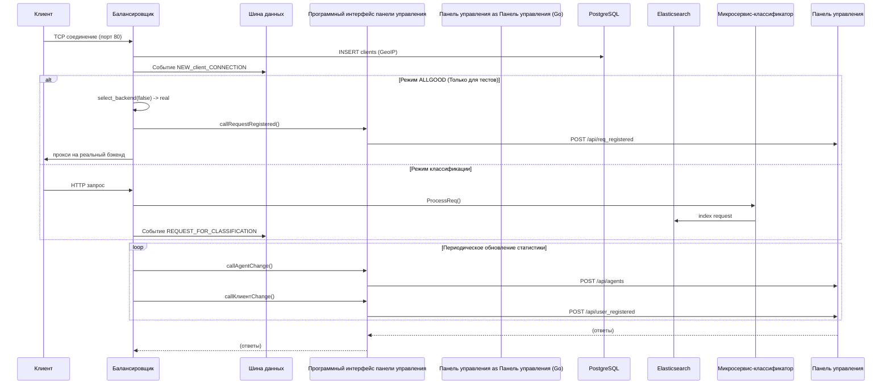

# HeavenGate — Application Usage & Component Integration

This document describes **what the application does** and **how its components integrate**.

---

## 1. What the Application Does (High Level)

**HeavenGate** is a **honeypot-aware TCP load balancer** that:

1. **Accepts client connections** on port 80 and routes traffic to backend servers.
2. **Distinguishes “real” vs “honeypot” backends** — legitimate traffic goes to real servers, suspicious/malicious traffic can be sent to honeypots.
3. **Tracks clients** in PostgreSQL (and optionally GeoIP), **indexes HTTP requests** in Elasticsearch, and **pushes events** (new clients, requests, health) over an internal **DataBus**.
4. **Reports to a Dashboard** (HTTP API) — client/agent counts and “request registered” events so a separate dashboard (Go/Python) can show live stats and request stream.
5. **Optionally runs a Dashboard component** via AppManager (separate process; currently wired for a Go binary under `go-apps/dashboard`).

So in practice: **reverse proxy + request logging + classification pipeline + dashboard reporting**.

---

## 2. Startup Flow

```
main()
  ├── init()                          # Databases & tables
  │     ├── Elasticsearch: connect, create REQ_INDEX if missing
  │     └── PostgreSQL: connect, create_table_safely("clients"), ("users")
  ├── AppManager manager; manager.start_all()
  │     └── Starts AppComponent(HG_DASHBOARD)  # e.g. dashboard process (path: go-apps/dashboard)
  ├── LoadBalancer balancer(IP_HASH)
  │     └── Subscribes to DataBus: SERVICE_HEALTH_UPDATE, REQUEST_CLASSIFIED, REQUEST_PROCESSED
  ├── balancer.add_backend(...)       # Real and (optionally) honeypot backends
  │     └── DashboardAPI::the().callAgentChange(real_count, honeypot_count)
  ├── balancer.start(80)              # Listen on port 80, start accept loop & stats updater
  └── while(running) sleep(1); balancer.stop(); manager.stop_all();
```

**Important:** `DataBus::instance().start()` is **never called** in `main`. So the DataBus worker thread does not run; events are queued but **not processed**. Classification and health-update handling therefore do not run unless something else starts the bus or the code is completed.

---

## 3. Component Overview

| Component | Role |
|-----------|------|
| **main.cpp** | Entry point, init, creates LoadBalancer and AppManager, runs main loop. |
| **LoadBalancer** | TCP accept on port 80, proxy client↔backend, GeoIP, DB client insert, DataBus publish, Dashboard API calls. |
| **DataBus** | In-process event bus (publish/subscribe). Events queued and dispatched by a worker thread (only if `start()` is called). |
| **DashboardAPI** | Singleton HTTP client to dashboard service: report clients count, agents count, “request registered” (client_ip, server_id, is_malicious). |
| **AppManager** | Starts/stops external “components” (e.g. dashboard process). |
| **PostgressQLManager** | PostgreSQL connection and safe table/insert/update/select helpers. |
| **ElasticStorage (SimpleElasticsearchClient)** | Elasticsearch HTTP client; index request documents. |
| **ReqClassifier** | Parses HTTP, builds JSON, indexes request in Elasticsearch. |
| **User / load_web_token** | Token→user resolution and permissions (e.g. for REST API that serves dashboard). |
| **Dashboard (Go)** | Separate service: receives POSTs from C++ (agents, clients, req_registered), serves SSE and UI. |

---

## 4. How Components Integrate

### 4.1 Client Connection (LoadBalancer)

1. **Accept** on port 80 → `handle_accept()`.
2. **Client IP** from socket; **GeoIP** via `geo2ip`; **PostgreSQL**: insert into `clients` (note: code uses table name `"clinets"` — likely typo).
3. **DataBus** `publish(NEW_CLIENT_CONNECTION, …)` with client_ip, client_id, Ip2GEO, timestamp.
4. **Routing mode:**
   - **If `ALLGOOD`:** route directly to a **real** backend (`select_backend(false, client_ip)`), then `connect_to_backend` → `start_proxying`.
   - **Else (classification mode):** call `handle_client_request(client)` (no backend yet).

### 4.2 Client Request Data (Classification Path)

1. In **classification mode**, when the client sends data, `read_from_client_and_forward()` runs:
   - **ReqClassifier::ProcessReq(client_id, request_data)** → parse HTTP, jsonify, **index document in Elasticsearch** (REQ_INDEX).
   - **DataBus** `publish(REQUEST_FOR_CLASSIFICATION, …)` with client_ip, client_id, request_data, client_ptr.
2. **Intended flow:** some subscriber handles `REQUEST_FOR_CLASSIFICATION`, decides “malicious” or “benign”, and **publishes** `REQUEST_CLASSIFIED` with `client_ip` and `classification`.
3. **LoadBalancer** subscribes to **REQUEST_CLASSIFIED** and in `handle_classification()`:
   - Calls `select_backend(is_malicious, client_ip)` (honeypot vs real).
   - `assign_backend_to_client(client_ip, backend)`.
   - There is a **TODO**: resume the actual client connection (client_ptr → connection); currently the connection is **not** resumed after classification.

**Gap:** In the C++ codebase there is **no subscriber** to `REQUEST_FOR_CLASSIFICATION` that publishes `REQUEST_CLASSIFIED`. So classification is only conceptual unless an external or future component consumes that event. In addition, **DataBus is never started**, so no events are dispatched.

### 4.3 LoadBalancer → Dashboard API

- **callAgentChange(real_size, honey_size)**  
  When backends are added (`add_backend`) and from the periodic stats updater (e.g. every 10s): POST to dashboard `/api/agents` with real/honeypot counts.
- **callClientChange(real_size, malicious_size)**  
  From **updateClientsStats()** (throttled to at most once per 2 seconds): POST to dashboard `/api/user_registered` with legit/malicious client counts.
- **callRequestRegistered(client_ip, server_id, is_malicious)**  
  From **select_backend()** after choosing a backend: POST to dashboard `/api/req_registered` for each routed request.

So the **dashboard** (Go app) gets: agent list/counts, client counts, and per-request “registered” events.

### 4.4 DataBus Event Flow (Design)

- **LoadBalancer** publishes: `NEW_CLIENT_CONNECTION`, `REQUEST_FOR_CLASSIFICATION`, `REQUEST_ROUTED`, `SERVICE_REGISTERED`, `SERVICE_HEALTH_UPDATE` (on health change).
- **LoadBalancer** subscribes to: `SERVICE_HEALTH_UPDATE`, `REQUEST_CLASSIFIED`, `REQUEST_PROCESSED`.
- **DataBus** is in-process only; no other C++ component currently publishes or subscribes. So:
  - **REQUEST_CLASSIFIED** would have to be produced by a subscriber of `REQUEST_FOR_CLASSIFICATION` (missing in C++).
  - **REQUEST_PROCESSED** would come from something that processes requests and reports success/failure (not wired in the current code).

### 4.5 REST API for Dashboard (C2 / Crow)

- **C2.cpp** (Crow HTTP server) exposes endpoints that use **DashboardAPI**:
  - e.g. **GET /api/clients/get** with Bearer token → **DashboardAPI::callGetClients(token)**.
- **callGetClients** / **callGetAgentStat**:
  - Validate token with **Userland::User::load_web_token(token)** (PostgreSQL + user_web_tokens table).
  - Check permissions (e.g. VIEW_CLIENTS, VIEW_AGENTS_STATS, PERSONAL_DATA_VIEW).
  - **callGetClients**: read from PostgreSQL `clients` (via PostgressQLManager), return JSON (optionally with IPs masked via `utils::MaskIPs`).
  - **callGetAgentStat**: permission check only; actual agent stats implementation is incomplete (e.g. missing return and DB query).

So: **Crow serves REST for the dashboard UI**; **DashboardAPI** talks to PostgreSQL and to the **Dashboard (Go)** HTTP API for push-style updates (agents, clients, req_registered).

### 4.6 Databases

- **PostgreSQL:**  
  - **clients** — client_id, client_ip, client_geo, timestamp, is_active.  
  - **users** — user accounts and permissions.  
  - **user_web_tokens** — token_hash, user_id, expires_at, etc., for `load_web_token`.  
  Used by: LoadBalancer (client insert/update), User (token lookup), DashboardAPI (callGetClients, etc.).
- **Elasticsearch:**  
  - Index for HTTP requests (REQ_INDEX); **ReqClassifier::ProcessReq** indexes each parsed request.  
  Used for logging/search of requests, not for routing decisions in the current code.

---

## 5. Data Flow Summary

```
[Client] ──TCP:80──► [LoadBalancer]
                          │
                          ├── GeoIP, insert "clients" (PostgreSQL)
                          ├── Publish NEW_CLIENT_CONNECTION (DataBus)
                          ├── ReqClassifier::ProcessReq → Elasticsearch
                          ├── Publish REQUEST_FOR_CLASSIFICATION (DataBus)
                          │      └── (no C++ consumer → no REQUEST_CLASSIFIED)
                          ├── On backend choice: callRequestRegistered() → [Dashboard Go]
                          ├── updateClientsStats() → callClientChange() → [Dashboard Go]
                          └── add_backend / stats → callAgentChange() → [Dashboard Go]
                          │
                          └── Proxy ◄──► [Real Backend] or [Honeypot Backend]

[Dashboard Go] ◄── POST /api/agents, /api/user_registered, /api/req_registered
[Dashboard UI] ──GET /api/clients/get (Bearer token)──► [Crow] ──► DashboardAPI ──► PostgreSQL (User + clients)
```

---

## 6. Current Gaps / Incomplete Integration

1. **DataBus not started** — `DataBus::instance().start()` is never called, so no events are processed; classification and health-update handlers never run.
2. **No producer of REQUEST_CLASSIFIED** — No C++ (or described) component subscribes to `REQUEST_FOR_CLASSIFICATION` and publishes `REQUEST_CLASSIFIED`.
3. **Classification path does not resume connection** — In `handle_classification()` the code has a TODO: map `client_ptr` back to the connection and continue proxying; the client connection is not actually resumed after classification.
4. **callGetAgentStat** — Incomplete (missing return and real agent stats from DB/backend).
5. **AppComponent dashboard** — Configured as `go-apps/dashboard` but `run()` uses a Python path; Go dashboard is typically built/run separately (e.g. from `Dashboard/main.go`).
6. **Table name typo** — Insert uses `"clinets"` instead of `"clients"` in one place.

---

## 7. Configuration (config/default.ini)

- **POSTGRE_***, **ELASTIC_*** — DB connections.  
- **DASHBOARD_HOST**, **DASHBOARD_PORT** — Dashboard API base URL.  
- **MAX_BUS_QUEUE_SIZE**, **BUS_REQUEST_TIMEOUT** — DataBus tuning.  
- **DASHBOARD_AUTOUPDATE_PERIOD** — Interval for LoadBalancer stats updater (e.g. 10s).  
- **SHOW_REQ_LOG** — Log outgoing dashboard API requests.

---

## 8. Summary Table

| From | To | What |
|------|-----|------|
| main | PostgreSQL, Elasticsearch | init: create tables / index |
| main | AppManager | start_all (dashboard process) |
| main | LoadBalancer | create, add_backend, start(80) |
| LoadBalancer | DataBus | publish NEW_CLIENT, REQUEST_FOR_CLASSIFICATION, REQUEST_ROUTED, SERVICE_*, HEALTH_* |
| LoadBalancer | DataBus | subscribe REQUEST_CLASSIFIED, SERVICE_HEALTH_UPDATE, REQUEST_PROCESSED |
| LoadBalancer | DashboardAPI | callAgentChange, callClientChange, callRequestRegistered |
| LoadBalancer | PostgreSQL | clients insert/update |
| LoadBalancer | ReqClassifier | ProcessReq → Elasticsearch |
| Crow (C2) | DashboardAPI | callGetClients, callGetAgentStat |
| DashboardAPI | User | load_web_token |
| DashboardAPI | PostgreSQL | clients select, user_web_tokens (via User) |
| DashboardAPI | Dashboard (Go) | HTTP POST agents / user_registered / req_registered |

This is the **current usage and how all components integrate** as of the reviewed codebase.


```mermaid
flowchart TD
    %% Основной поток
    A[Клиент устанавливает TCP соединение на порт 80] --> B[Балансировщик]
    B --> C[(PostgreSQL: INSERT GeoIP)]
    B --> D[Шина данных: событие NEW_client_CONNECTION]

    D --> E{Режим работы?}

    %% Ветка ALLGOOD (тесты)
    E -->|ALLGOOD| F[select_backend(false) → real]
    F --> G[API панели управления: POST /api/req_registered]
    G --> H[Прокси на реальный бэкенд]
    H --> I[Ответ клиенту]

    %% Ветка классификации
    E -->|Классификация| J[Клиент отправляет HTTP запрос]
    J --> K[Балансировщик вызывает ProcessReq у микросервиса-классификатора]
    K --> L[Микросервис индексирует запрос в Elasticsearch]
    L --> M[Микросервис классифицирует запрос<br>по правилам YARA и обученной модели]
    M --> N[Микросервис возвращает результат балансировщику]
    N --> O[Балансировщик определяет тип бэкенда:<br>реальный сервер или honeypot]
    O --> P[Прокси на выбранный бэкенд]
    P --> Q[Ответ клиенту]

    %% Фоновые процессы (независимый цикл)
    subgraph Фоновые_процессы [Фоновые процессы]
        direction LR
        R[Периодическое обновление статистики] --> S[callAgentChange → POST /api/agents]
        R --> T[callClientChange → POST /api/user_registered]
        S --> U[Панель управления отвечает]
        T --> U
    end

    %% Связь фоновых процессов с основным потоком (асинхронность)
    I -.-> Фоновые_процессы
    Q -.-> Фоновые_процессы
```
